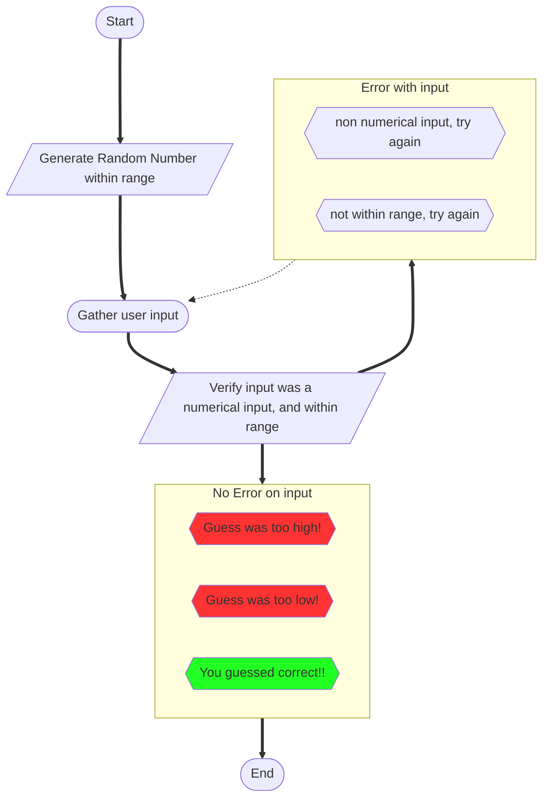

```mermaid
flowchart TD
Start([Start])
End([End])
Start ==> id1[/Generate Random Number within range/]
id1 ==> id2([Gather user input])
id2 ==> id3[/Verify input was a numerical input, and within range/]
  subgraph ide1 [Error with input]
  subid1{{non numerical input, try again}}
  subid2{{not within range, try again}}
  end
id3 ==> ide1
  subgraph ide2 [No Error on input]
  subid3{{Guess was too high!}}
  subid4{{Guess was too low!}}
  subid5{{You guessed correct!!}}
  subid3:::incorrect
  subid4:::incorrect
  subid5:::correct
  classDef correct fill:#2f2
  classDef incorrect fill:#f33
  end
id3 ==> ide2
ide1 -.-> id2
ide2 ==> End

%%The first box describes generating a random number within the specificed range
%%After the input is gathered from the user it is tested to see if it is a numerical input
%%If not a numerical input the user is prompted to re enter input.
%%If the input passes the test and is numerical/within the set range it is compared to the random
%%number that was generated
%%Then depending on if it is high/low/or correct it outputs the proper response.
```
